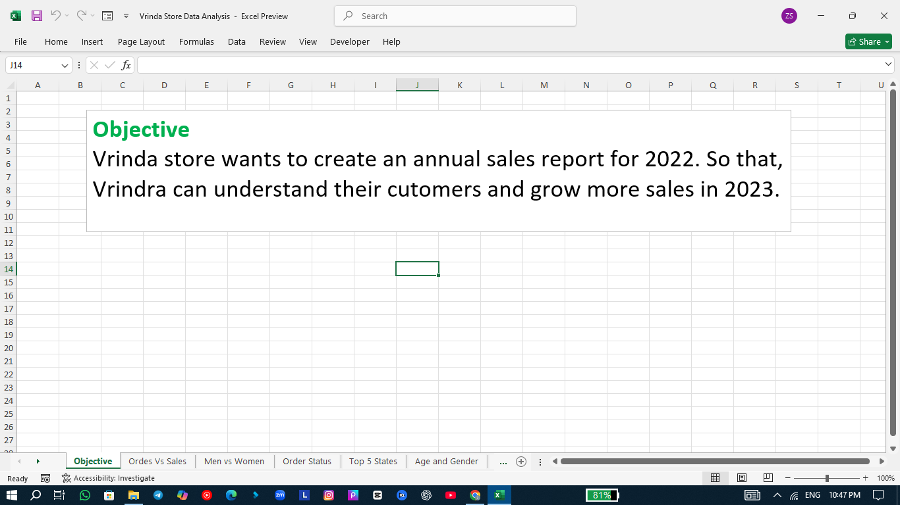
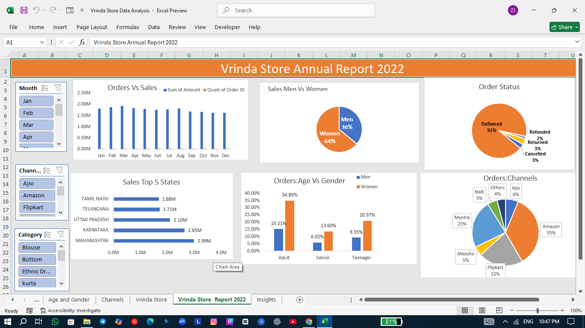
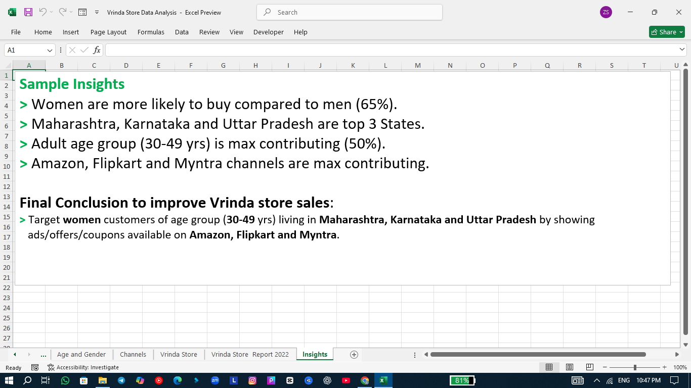

# 📊 Vrinda Store Data Analysis (2022)

## 🎯 Objective
Vrinda Store wants to create an annual sales report for 2022 so that they can understand their customers better and grow more sales in 2023.

## 📈 Dashboard Overview
This Excel dashboard provides a detailed analysis of Vrinda Store’s sales data for 2022.  
It helps identify customer segments, top-performing states, sales channels, and order patterns. 

**Dashboard Includes:**
- Monthly Orders vs Sales  
- Sales by Gender (Men vs Women)  
- Order Status Distribution  
- Top 5 States by Sales  
- Orders by Age and Gender  
- Orders by Channel (Amazon, Flipkart, Myntra, etc.)

## 🔍 Key Insights
✅ Women are more likely to buy compared to men (**65%**)  
✅ **Maharashtra**, **Karnataka**, and **Uttar Pradesh** are the top 3 states  
✅ The **Adult age group (30–49 yrs)** contributes the most (**50%**)  
✅ **Amazon**, **Flipkart**, and **Myntra** are the top contributing channels  

## 🧭 Final Conclusion
To improve Vrinda Store sales in 2023:
- Target **women customers** of age group **30–49 years**
- Focus on **Maharashtra, Karnataka, and Uttar Pradesh**
- Promote through **Amazon, Flipkart, and Myntra**
- Use **ads, offers, and coupons** to attract more customers

## 🛠️ Tools Used
- **Microsoft Excel**
  - Data Cleaning & Preparation  
  - Pivot Tables  
  - Charts (Bar, Pie, and Column)  
  - Slicers for Filters  
  - Dashboard Design & Formatting
    
## 🧠 Learnings from the Project
- Improved Excel Dashboard Designing skills  
- Learned data storytelling using visuals  
- Understood how to derive insights from sales data  

## 📷 Dashboard Preview

| Objective | Dashboard | Insights |
|------------|------------|-----------|
|  |  |  |

